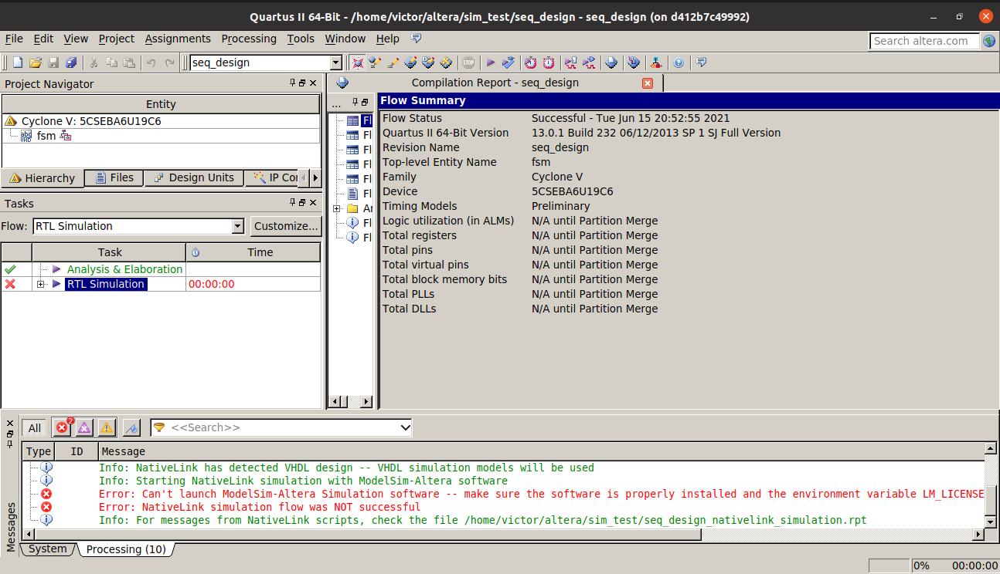
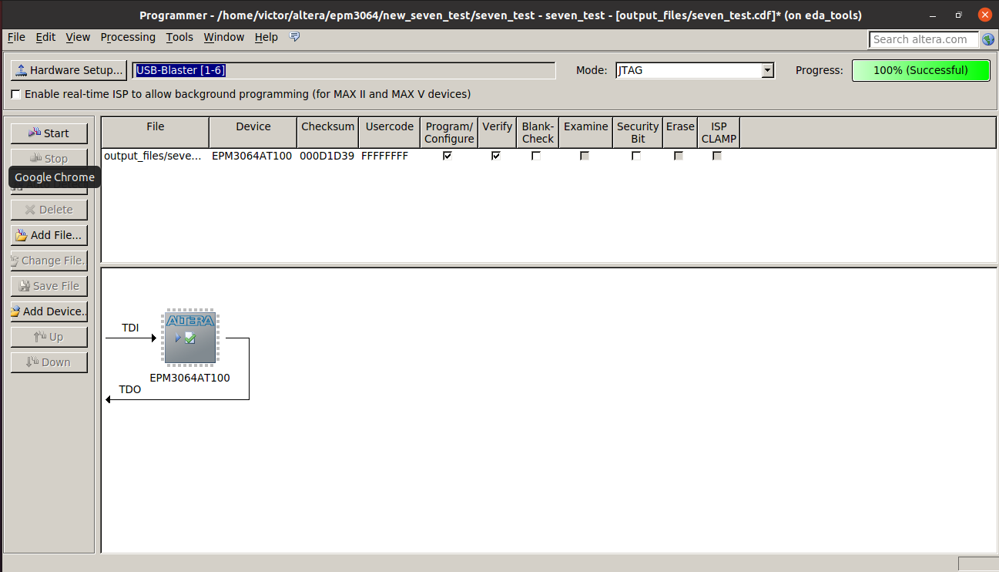
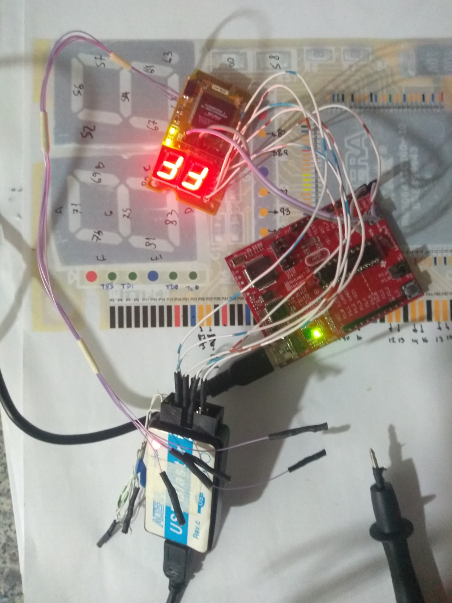

# EDA Tools: Intel/Altera Quartus II 13.0sp1
 
When you decide to learn programming digital circuits at first you bump into a big wall, the learning curve is steep and a part of this is the difficulty in creating an environment with the necessary tools to get started.

Despite the efforts of the open source community to support development for the major FPGA vendors, there are not a mature project yet with support for Intel/Altera FPGAs, that kind of work require a huge amount of reverse engineering effort, luckily there are projects working in this direction.

If you want to start programming right away on your recently bought [FPGA devkit](https://www.joelw.id.au/FPGA/CheapFPGADevelopmentBoards) or in some [cheap recycled board](https://hackaday.io/project/159853-fpga-board-hack), you will probably get astonished to realize that you need to download about ~15GB of bloatware just to get started and build the simple blinky example, although that logic synthesis and technology mappings are difficult problems they don't require that amount of complexity shifted to the tooling environment setup nor rest it on the newcomer hobbyist/engineer shoulders.

That is why here is a Dockerfile that ease your approach to the FPGA world setting up a working environment with the needed tools to develop on Intel/Altera FPGAs, it setups an old version of the software, in fact it is from 2013, but it works OK with a lot of devices families. Installing such old software on modern systems is kind of a difficult and tedious task, so I hope these Dockerfiles will be useful for you.

## Downloading from vendor

You can install either the *Web Edition* or the *Standard Edition* of the software, for the last one you must provide the proper license files, to find the differences between the two versions you can look up in the vendor website. Here there are the different devices supported by each version:

| Device family | Web Edition Support |  Subscription Edition Support |
|--------------:|:-------------------:|:-----------------------------:|
|MAX II|X|X| 
|MAX V|X|X|
|MAX 3000|X|X|
|MAX 7000|X|X| 
|Cyclone||X|
|Cyclone II|X|X|
|Cyclone III|X|X|
|Cyclone IV|X|X|
|Cyclone V|X|X| 
|Stratix||X
|Stratix II||X| 
|Stratix III||X|
|Stratix IV||X|
|Stratix V||X| 
|HardCopy II||X| 
|HardCopy III||X|
|HardCopy IV||X| 
|Arria II|X|X| 
|Arria V||X|
|Arria V GZ||X| 
|Arria GX||X|


For use the Web Edition you can [download Quartus II 13.0sp1 Web Edition](https://fpgasoftware.intel.com/13.0sp1/) from vendor website, either the complete *combined file* or the individual files, the combined file is just a tar file with the necessary files inside a *components* directory.

If you want to perform the synthesis flow you only need this file (you can check its MD5 sum):

```
bad6e4f431720bd16859a22bb34666d6  QuartusSetupWeb-13.0.1.232.run
```

For installing the optional RTL/Gate level simulator you need this one:

```
92ddd89285e72e063be198ff439c54d1  ModelSimSetup-13.0.1.232.run
```

The component installation is optional, you only have to download and install what you need, in the combined file of the Web Edition these are already included: 

```
18262271d276a9966f42938e1e601aee  arria_web-13.0.1.232.qdz
4664b9bdd482c004c3c8d64fefc124ab  cyclonev-13.0.1.232.qdz
cdac3b93f0df21d7371e4395d31d0099  cyclone_web-13.0.1.232.qdz
64aaca8c4f6cd545d449be3ffd8cba50  max_web-13.0.1.232.qdz
```

For using the Standard Edition you can [download Quartus II 13.0sp1 Standard Edition](https://fpgasoftware.intel.com/13.0sp1/?edition=subscription&platform=linux) from vendor website, for use this version of the software you need the proper license files.

If you want to perform the synthesis flow you only need this file:

```
ae91ab69beab18da33e9c6d1c780a8f2  QuartusSetup-13.0.1.232.run
```

For install the optional RTL/Gate level simulator you need this one:

```
92ddd89285e72e063be198ff439c54d1  standard/ModelSimSetup-13.0.1.232.run
```

Notice that ModelSim setup have the same MD5 sum in both cases, this is because it contains both: the *Altera Edition* and the *Altera Standard Edition*, you can use whatever you want, but for Altera Edition you need the proper license files.

Like as the Web Edition, you can download whatever component family files that you need, either in the combined file or as individual files.

## Build the image

Building the image requires two steps, one for build the base image with or without ModelSim, and the other one to add the desired devices.

For building the base image you need to place the files of this repository and the needed files pointed on the previous section in the same directory, move to that direction and execute:

```bash
docker build -t quartus_base:13.0.1.2 -f Dockerfile_with_modelsim .

```

To generate a base image tagged **quartus_base:13.0.1.2** including ModelSim or:

```bash
docker build -t quartus_base:13.0.1.2 -f Dockerfile .
```

To avoid the ModelSim inclusion.

Both Dockerfiles mentioned above install the Web Edition by default, but you can specify in the Quartus installer an override argument named **QUARTUS_INSTALLER**, like the following example:

```bash
docker build -t quartus_base:13.0.1.2 -f Dockerfile_with_modelsim --build-arg QUARTUS_INSTALLER=QuartusSetup-13.0.1.232.run .
```

Next, to generate the base image you can add all the device families that you want by just placing the *qdz* extension files in the building directory, and run the following builder command:
 
```bash
docker build -t quartus:13.0.1.2 -f Dockerfile_devices --build-arg QUARTUS_BASE=quartus_base:13.0.1.2 .
```

To generate a complete image tagged **quartus:13.0.1.2** using as base the image tagged **quartus_base:13.0.1.2**.

After build the image you can delete the intermediate *builder* tagged image as follow:

```bash
docker image prune --filter label=stage=builder
```

## Running the image
 
There are some scripts provided in this repository to execute the most common Quartus tools like *quartus_asm*, *quartus_fit*, *quartus_map*, *quartus_sta*, and the full GUI *quartus* IDE.

They are located in the *shell*, *powershell*, and *cmd* directories, and the main idea is to provide support for Linux Docker and Desktop Docker over WSL2 for Windows users.

There is a main script named quartus13[.sh|.ps1|.cmd] that calls `docker run` with the proper environment variables and arguments, also, there are some scripts files in each directory that invoke the quartus13 main script referencing the tool to be executed, the idea is that you can access every tool from the host system, it mounts the user context in an ephemeral container and call the tool with the parameters provided on the host call.

### From Linux

In Linux it invokes the scripts passing the whole current user context directly to the container instance, that means it shares: `/etc/passwd` to provide user information, `/etc/group` to provide group information, `/tmp/.X11-unix` to share X's Unix Socket for GUI applications, `$HOME` directory to have access to all user files inside the container instance, and sets `$PWD` as the *current working directory*, so in this way you can execute the tools seamlessly and integrating them in your own build scripts. 

This is the main script excerpt that invoke the docker instance:

```bash
docker run --rm \
--user $(id -u):$(id -g) \
-e DISPLAY \
-e PATH=/bin:/sbin:$QUARTUS_PATH \
-e LD_LIBRARY_PATH=$QUARTUS_PATH \
-e LM_LICENSE_FILE=$LM_LICENSE_FILE \
-e MGLS_LICENSE_FILE=$MGLS_LICENSE_FILE \
--mac-address=$LICENSE_MAC \
-v /etc/passwd:/etc/passwd:ro \
-v /etc/group:/etc/group:ro  \
-v /tmp/.X11-unix:/tmp/.X11-unix \
-v $HOME:$HOME \
-w $PWD \
--ipc=host \
-v /dev/bus/usb:/dev/bus/usb \
--device-cgroup-rule='c *:* rmw' \
--security-opt seccomp=unconfined \
-ti $QUARTUS13_IMAGE $@
```

The `LM_LICENSE_FILE`, and `MGLS_LICENSE_FILE` environment variables are needed to point the license files, the first one is needed when you use the Standard Version of Quartus, and the second one only when you want to use ModelSim Altera Edition instead of ModelSim Altera Starter Edition, and due to the licenses are tied to a specific host ID, you can pass that specific MAC address in the `LICENSE_MAC` variable. How to get the license files for those legacy software is out of the scope of this document, you have to contact with the vendor or one of their distributors.

The Quartus GUI uses the [MIT-SHM X11 extension](https://www.x.org/releases/X11R7.7/doc/xextproto/shm.html) to speed up its interface so we need to use the `--ipc=host` to share the docker host's shared memory space with the docker guest in order to use the GUI, so in the case you don't use the GUI, you are free to remove this option.

In order to use the USB Blaster programmer from the Quartus suite, you need to pass the USB tree part of the `dev` filesystem with `-v /dev/bus/usb:/dev/bus/usb` and to give access to hot-plugged devices you have to pass the option `--device-cgroup-rule='c *:* rmw'` to allow access to all major and minor character devices.

The option `--security-opt seccomp=unconfined` is used because ModelSim try to disable **ALSR**, if this can't disable it, it runs without any problem when is executed in stand-alone mode, but will show a warning as follow:

```
victor@d412b7c49992:~/altera/quartus_tools$ /opt/altera/13.0sp1/modelsim_ae/linuxaloem/vsim
** Warning: setting ADDR_NO_RANDOMIZE failed - Success.
Reading /opt/altera/13.0sp1/modelsim_ae/tcl/vsim/pref.tcl 
```

And such warning will stall the execution of ModelSim when it is accessed from Quartus, with a confusing message about the license files:



### From Docker Desktop (Windows)

Running the tools in *Windows Subsystem for Linux 2 (WSL2)* is almost as it is in Linux, but the state of Docker for WSL2 was not the best in my own experience, for example [it was impossible to mount a USB key inside WSL](https://docs.microsoft.com/en-us/windows/wsl/wsl2-mount-disk#limitations) using standard Docker directory mount nor mount the whole device, for this you need at least [Windows Insider preview build 20211](https://github.com/microsoft/WSL/discussions/6061) that you can only get from the [Insider Dev Channel](https://blogs.windows.com/windows-insider/2020/09/10/announcing-windows-10-insider-preview-build-20211/), and when you `docker build` your images it takes ages.

This is the main script excerpt that invoke the docker instance (in the `cmd` version):

```batchfile
docker run --rm ^
--mac-address %LICENSE_MAC% ^
--security-opt seccomp=unconfined ^
-e LM_LICENSE_FILE=%QUARTUS_LICENSE% ^
-e MGLS_LICENSE_FILE=%MODELSIM_LICENSE% ^
-e DISPLAY=%DISPLAY% ^
-e PATH=/bin:/usr/bin:%QUARTUS_PATH% ^
-e LD_LIBRARY_PATH=%QUARTUS_PATH% ^
-e LD_PRELOAD=inode64.so ^
-v "%CD%:/workspace" ^
-w /workspace ^
-ti %QUARTUS13_IMAGE% %*
```

Like in Linux, the `LM_LICENSE_FILE`, and `MGLS_LICENSE_FILE` environment variables are needed to point the license files, the first one is needed when you use the Standard Version of Quartus, and the second one is when you want to use ModelSim Altera Edition instead of ModelSim Altera Starter Edition, and due the licenses are tied to a specific host ID, you can pass that specific MAC address in the `LICENSE_MAC` variable. How to get the license files for those legacy software is out of the scope of this document, you have to contact with the vendor or their distributors.

For running the GUI version on Windows you need an X Server like [MobaXterm](https://mobaxterm.mobatek.net/), [Xming](http://www.straightrunning.com/XmingNotes/) or [VcXsrv](https://sourceforge.net/projects/vcxsrv/) properly configured in your system, and pass the `DISPLAY` environment variable to the docker engine. You can edit the script according to your configuration if needed, if you have troubles with this and have doubts about you can look for some tutorials on how to run GUI programs on Docker Desktop.

Opposite to my Ubuntu 20.04 default X Server, the VcXsrv on my Windows computer don't advertise the MIT-SHM feature, so the `--ipc=host` option is not needed, anyway is not available on a Windows setup.

Trying to setup Quartus on Docker Desktop was a real headache, one of the problems was really hard to debug, so I had to use *GDB* for debug it, since there was a problem with the license validation schema.

When I check for a granted feature with ModelSim's `modelsim_ae/linuxaloem/mgls/mgls_ok`, I got different results if the license file was on the docker's union filesystem or on a host mounted filesystem.

Example (**Union filesystem**):
```bash
root@5e7740f94a48:/workspace# MGLS_LICENSE_FILE=/tmp/modelsim.dat MGLS_HOME=/opt/altera/13.0sp1/modelsim_ae/linuxaloem/mgls/ /opt/altera/13.0sp1/modelsim_ae/linuxaloem/mgls/bin/mgls_ok vmdmsrep
Checking availability of "vmdmsrep".

License granted through "vmdmsrep".
```

Example: (**Host mounted filesystem**):
```bash
root@5e7740f94a48:/workspace# MGLS_LICENSE_FILE=/workspace/license/modelsim.dat MGLS_HOME=/opt/altera/13.0sp1/modelsim_ae/linuxaloem/mgls/ /opt/altera/13.0sp1/modelsim_ae/linuxaloem/mgls/bin/mgls_ok vmdmsrep
Checking availability of "vmdmsrep".
                                                                                                                                              //  License request for vmdmsrep feature failed                                                                                               
```

When tracing the code that deals with the license granting system (*mgls_asynch*) with GDB, you can find that the problem lies in that the syscall *stat64* (195) generates an **EOVERFLOW** error when ask for the license file mounted in the host filesystem, this is because ModelSim is a 32 bit piece of software and calls the 32 bit version of this syscall, but the kernel returns a 64 bit inodes that don't fit in the struct that passed by reference to it, luckily for us, we are not the first ones experiencing this problem that is [well described and solved](https://www.mjr19.org.uk/sw/inodes64.html) already.

In resume, the Dockerfile (in its `builder` container) has the necessary steps to build a [wrapper that fix it](https://www.mjr19.org.uk/sw/inode64.c) for 32 bit version programs and a dummy one for the 64 bits version to be **LD_PRELOAD**ed.

## Notes

The ModelSim installer comes with the *Altera Edition* and *Altera Starter Edition* version regardless of the page you access it, to change version you want to use you must change the ModelSim path in the *EDA Tools Options* Category that you can access in the *Tools -> Options* menu of Quartus.


A simple image with Quartus GUI, and some FPGA families is around ~15GB, but if you take the same image and trim it for the core functionality in a workflow that don't require Quartus GUI, you can get a very small image (I got a working one with ~950MB), I have done a lot of Python scripting for this, however you can get the idea of how to do it [here](https://stenci.la/blog/2017-07-docker-with-strace/) or you can get a complete solution for this [here](https://github.com/docker-slim/docker-slim) or [here](https://github.com/ak-1/sackman).

## Screenshot

An EPM3064 CPLD programmed:



With a cheap USB Blaster clone:



